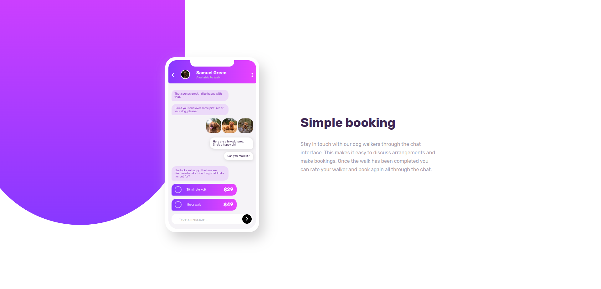

# Frontend Mentor - Chat app CSS illustration solution

This is a solution to the [Chat app CSS illustration challenge on Frontend Mentor](https://www.frontendmentor.io/challenges/chat-app-css-illustration-O5auMkFqY). Frontend Mentor challenges help you improve your coding skills by building realistic projects.

## Table of contents

- [Overview](#overview)
  - [The challenge](#the-challenge)
  - [Screenshot](#screenshot)
  - [Links](#links)
- [My process](#my-process)
  - [Built with](#built-with)
  - [What I learned](#what-i-learned)
  - [Continued development](#continued-development)
  - [Useful resources](#useful-resources)
- [Author](#author)
- [Acknowledgments](#acknowledgments)

## Overview

### The challenge

Users should be able to:

- View the optimal layout for the component depending on their device's screen size
- **Bonus**: See the chat interface animate on the initial load

### Screenshot

### Links

- Solution URL: [here](https://github.com/Valhalla-2/chat-app-)
- Live Site URL: [here](https://chat-app-to-frontend.netlify.app/)

## My process

### Built with

- Semantic HTML5 markup
- CSS custom properties
- Flexbox
- Mobile-first workflow

### What I learned
[Css Animation](https://css-tricks.com/almanac/properties/a/animation/)

### Continued development
Achieve the layout with even lesser code if you can .

### Useful resources

- [resource 1](https://developer.mozilla.org/en-US/docs/Web/CSS/CSS_Animations/Using_CSS_animations) - Really helpfull MDN reference guide of Css Animation
- [resource 2](https://github.com/dusanlukic404/chat-app) - This is where I got the idea on how to do the animation for the messages

## Author

- Github - [valhalla-2](https://github.com/Valhalla-2)
- Frontend Mentor - [@valhalla-2](https://www.frontendmentor.io/profile/Valhalla-2)

## Acknowledgments

Thanks to [Dušan Lukić's](https://github.com/dusanlukic404/chat-app) solution for this project , it really helped me on my animation .
